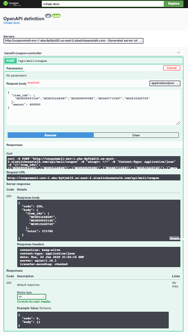

# Coupon - MeLi
Propuesta solución a nueva implementación de MercadoLibre para usuarios que tengan cupones por redimir.

### Caracteristicas generales
La solución fue planteada bajo las caracteristicas del ejercicio, y se propone la siguiente arquitectura para el cumplimiento de requisitos no funcionales.
#### Diagrama de Arquitectura


### Ejecución del api
En el siguiente [enlace](http://couponmeli-env-1.eba-8p9jm2i5.us-east-2.elasticbeanstalk.com/) se encuentra el api-rest desplegado en AWS.
```sh
http://couponmeli-env-1.eba-8p9jm2i5.us-east-2.elasticbeanstalk.com/
```
#### Pruebas de ejecución
Para su ejecución el api-rest cuenta con swagger para la documentación de los contratos utilizados, en el siguiente [enlace](http://couponmeli-env-1.eba-8p9jm2i5.us-east-2.elasticbeanstalk.com/swagger-ui.html) se encuentra:
```sh
http://couponmeli-env-1.eba-8p9jm2i5.us-east-2.elasticbeanstalk.com/swagger-ui.html
```
En la siguiente imagen se muestra un ejemplo de ejecución:

```sh
Se realizó la prueba con el siguiente body:
{
  "item_ids": [
    "MCO509093160","MCO501668687","MCO500099080","MCO487719207","MCO515420765"
  ],
  "amount": 400000
}
```


Además de ello se quiso realizar una prueba con los datos indicados en el test, este se cubre con las pruebas unitarias en JUnit.


#### Coverage by Jacoco
El coverage obtenido en la revisión del proyecto es de __% para su validación se hizo uso del plugin de maven para la revisión de código. En la siguiente imagen se encuentra el resultante:

### Despliegue Local
Para poder realizar el despliegue se debe contar con el acceso al código de este repositorio, para ello realizar la clonación o la descarga del código fuente.
```sh
$ git clone https://github.com/jacking1008/coupon-meli.git
```
Para su ejecución local se puede realizar de varias maneras, entre unas de ellas está mediante Java con su VM, y docker.
#### Nativo - Java
Dentro del directorio del proyecto ejecutar estos comandos.
```sh
$ mvn clean package
$ cd target
$ java -jar coupon-meli-0.0.1-SNAPSHOT.jar

NOTA: Para hacer esta ejecución se debe tener el jdk-11 y maven instalado, además de ello tener configurado sus variables de entorno.
```
#### Docker
Dentro del directorio del proyecto ejecutar estos comandos.
```sh
$ docker build -t meliCoupon -f Dockerfile
$ docker run -i -p 5000:5000 --name meliCoupon

NOTA: Para hacer esta ejecución se debe tener instalado y configurado Docker.
```